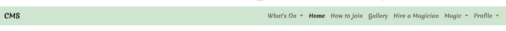
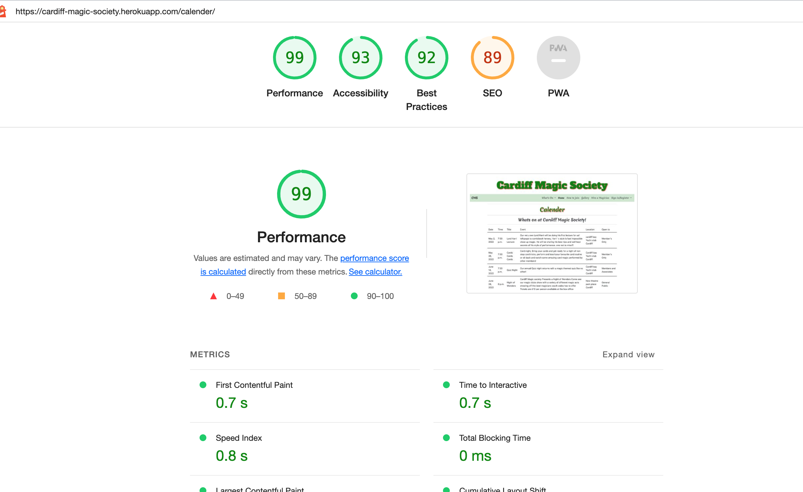

# Milestone Project 4 - Cardiff Magic Society

## Contents

 ## Project Aims and Design
 

 
click to expand

 * ### [1.Project Aim](#project-aim)
 * ### [2.Website features](#website-features)
 * ### [3.Design Layout](#design-layout)
 * ### [4.Code Structure](#code-structure)
 * ### [5.Coding Bugs](#coding-bugs)
 

 ## Deployment and Testing
 

 
click to expand

 * ### [6.Deployment](#deployment)
 * ### [7.Testing](#testing)
 * ### [8.Credits](#credit)
 * ### [9.Evaluation](#evaluation)
 * ### [10.Future Changes](#future-changes)
 

## Project aim

The aim of the project is to build a functional website for Cardiff Magic Society

## Background

Cardiff Magic Society is club based in cardiff for magicians and people interested in magic. The club holds regular monthly meetings which involve performances, lectures, social gatherings, workshops and other events. The society also has its own magic supply for members to buy magic items. As the working of magic is secret the society only allows the genral public access to certain areas of the societies activities for example some meetings are members only meetings.

### Why a website

The society use to have a website for members or anyone interested detailing when the meetings were and how to join. Members had issues with the site as it was hard to update and manage, didnt have much useful information and didnt look like a creditable site. Recently they switched to just using social media, however they have run into issues with this approach. Not all members on social media, and not all members on social media use the same platforms meaning more social media accounts are needed to be maintained and updated regularly.
A new functional website will give all members or anyone interested one location to find all the information about the society.

## Website features

### Research

To find out what they want for the website I had a meeting with the society board members and general mebers about what they would like to see from a website for the club. The main reoccuring points were :

- up to date calender on society upcoming events
- mordern looking website which is easy to navigate
- access to magic shop
- access to videos of past lectures
- to advertise members private performnce services
- how to join the society 
- Gallery of photos taken at meetings
- An easy to maintain website, easily updateable calender, gallery, 

### Website Needs

To incorporate what the society wants from a website I have broken down the requirements into website pages for the site

- About : describing the society and what its about
- Contact : how to get in contact with the society and where it meets
- How to join : how to join the society
- Gallery : pictures from society meetings
- Magicians for hire : advertisements of magic services from members
- Profile : a private individual area for members to update their own information.
- shop : to sell society product online

### Design Needs

- Modern looking : proffesional looking website
- Easy Navigation : the website should be intuitive to navigate
- Easy to update : Key areas that regularly change need to be easy for a user to modify eg. calender, latest news
- Restricted Access : members only information restricted from public access
- All devices : Website should function on all size screens

### User Needs

Due to the nature of the society I have identified three different types of users who would be accessing the website each with their own user story:

- The General Public : Anyone browsing the internet, or looking for magic content/information
- Member : Someone with a keen inerest in or performs magic,
- Admin Member : A member of the society who is in charge of updating calender and events

#### General public

As a general user I want to :
- To understand what the society is about : So I know what its about
- see visual representation of what the society is like : So I can get a feel for what it like
- understand the process to join the society : So I know how to join
- find a magician to hire : So I can hire entertinment for an event
- see when the next meeting is : So I can attend
- contact the society : To make enquires
- sign up as a member : to join the society 

#### Member

As a member user I want to :
- see latest news : so I know what is currently happening in the magic world
- access the shop : so I can purchase magic goods
- see my previous shop order : so I know what I have previously brought 
- put up an advertisement : to advertise my magic performance to the general public
- edit my advert : to update my advert with my latest info

#### Admin Member

As an admin user I want to :
- update calender : to add, delete or make changes to up coming events
- update gallery : add new images to show current look and feel of society
- update online shop : add, delete or edit products availiable for purchase online

## [Back to top](#contents)

## Action Plan

To achieve the requirements of the society I'm going to build a website consisting of 11 pages with 3 levels of access
public , member , admin. Each level will have the appropriate pages hidden from them up to member which has access to all pages. Admin user will have member level access with the additional edit buttons to update relevant pages.

website pages :

- Home : will contain information about society and contact information
- How to join : will contain information on how to join the society
- Gallery : will contain images from society nights
- Magician's for hire : Will contain adverts from members for their private performance services
- sign in/ register : Where you can fill in form and sign up or sign in to the Society
- Profile : Personal page for user once signed up to edit details, see purchase history, create advert
- Shop : containing society products for sale

Public Access : Home, How to Join, Gallery, Magician's for Hire, sign in/register

Member : Home, How to Join, Gallery, Magician's for Hire, sign in/register, Profile, Shop

Admin member will have the ability to edit : Magician's for Hire, Shop, Gallery and Calender

Website will be built using : Django framework, Python, Javascript, CSS, HTML, MySQLPostgres

## Design Layout

### Sketched Layout

### Main Page View - large monitor

### Main Page View - tablet

### Main Page View - mobile

## [Back to top](#contents)

### Actual Layout

### Main Page View - large monitor

### Main Page View - tablet

### Main Page View - mobile

### Navbar

Navbar contains drop down menus for users to navigate around website, this is so new future features added to website can live inside a category easily and not disrupt layout of the page. Same navbar is on all pages so once users are familiar with this feature they can always navigate the site.
Navbar collapses to a dropdown menu on smaller screen sizes.
Navbar code can be found in templates/base.html so it extends across every page of the website.

### Footer

Simple plain footer with links to society's social media, same footer across all pages so at any point user can switch to social media accounts.
Footer code can be found in templates/base.html so it extends across every page of the website.

### Font style 

- Choosen 3 different fonts to be used throughout the webeste
- 'Alfa Slab One' to be used as title font
- 'Merienda' to be used as subtitle and text throughout the site
- Also standard font usd in areas in which its important for the user to be very clear on what they are reading/selecting. This is evident on website in situation lkie completing an order.

### Website Colours

- Colours choosen to use are based on the colours used for the society's badge, this is based on the coloues of the welsh flag. To keep in theme with this the colours used at varying shades are:
- Green
- Red
- White
- Also Black as with the fonts, used to be clear and easily seen by user.

### Profile page layout

- Profile page is layed out in such a way that there is space for future additional features to be easily added to page without disrupting or needing to change the page layout drastically..
- The main row is split into two divs with one currently empty ready for additional features to be added.

### Site Management page layout

- The management page, like the profile page is layed out in such a way that there is space for future additional features to be easily added to page without disrupting or needing to change the page layout drastically..
- The main row is split into two divs with one currently empty ready for additional features to be added.

### Maintenance page

- This page was created for situations when certain pages need to come down for whatever reason i.e maintenance. This page is located in the files in the home app as the home app is least likely app on site to require change or sufficent change that would disrupt service. home/templates/home/maintenance.html .

## [Back to top](#contents)

## Code Structure

Django apps :
- cardiff_magic_society - contains settings.py, urls.py wsgi.py asgi.py pycache and _init_.py for project.
- bag -------------- contains html templates and models.py for shopping bag found in navbar under profiles.
templates - bag.html
- calender --------- contains html templates and models.py for calender and editing calender. 
templates - calender.html  add_event.html   edit_event.html
- checkout --------- contains html templates and models.py for checkout and stripe payment system.
templates - checkout.html checkout_success.html confirmation emails - confirmation_email_body.txt confirmation_email_subject.txt
- gallery ---------- contains html templates and models.py for gallery and editing gallery.
templates - gallery.html  add_image.html
- home ------------- contains html templates and models.py for home page, maintenance page and how to join page.
templates - index.html(home page)  join.html  maintenance.html  
- magician --------- contains html templates and models.py for Hire a magician page, and editing.
templates - add_hire.html  edit_hire.html  magic_hire.html
- management ------- contains html template for site management page, which has edit button links to other apps.
templates - mangement.html
- profiles --------- contains html templates and models.py for users profile page, and editing address/advert.
templates - order_history.html  profile.html
- shop-------------- contains html templates and models.py for shop and editing products.
templates - shop.html  add_product.html  product_detail.html  edit_product.html

- media ----------- contains images for the shop products, also readme_images - which contains images for README.md.
- templates ------- contains base.html template for website, allauth, includes- toasts for website.
- Static----------- contains base.css for website.
- requirements.txt - contains all installed files needed to run website.

#### templates/Base.html

- is the main template for the website, it contains a title, navbar and footer which are used on every page throughout the site.

- In the base is also exta content blocks for any additional javascript or css needed for specific pages in the future as well as additional headings and page content.

- At the bottom is also the javascript need for the toasts, this to allow the toasts to function on all pages.

#### static/css/base.css

- contains primary css styling for the base.html and the website. The checkout app has its own css file for specfic features,(also has its own js as well to handle the stripe payments).

base.css structure :

- font style for buttons
- blank space filling for maintenace page and log in page
- Header 
- home page images
- bootstrap toasts 
- media queries title
- media queries home page
- Allauth form formatting
- Galley

### Emails

- set up an gmail account for the website, cardiffmagicsociety@gmail.com 
- This was then linked up in cardiff_magic_society/settings.py as the default email in which all emails from the website are sent from.
## [Back to top](#contents)

## Coding Bugs

### Issue - Subtotal and Grandtotal code not working

 - subtotal code not working not working on shopping bag page or grandtotal working on checkout succes page
 - Previously before deployment subtotal on shopping bag page and grandtotal on checkout success page was working, an error has developed somewhere during the deployment process.
 - Previously before deployment had issue with subtotal on checkout page, was removed as not critical as all over totals were working fine.
 
  
${{ item.product.price | calc_subtotal:item.quantity }}
 

  

### Issue fix 

- Added subtotal calculation in bag app - templatetags/bag_tools.py.

- Tested this through development port, this change also fixed grand total being displayed on checkout success.

### Issue - Media queries not working

- Media queries in static/css/base.css are not being applied to home page when viewing website on screens small than 995px
- On screens smaller than 995px the two pictures either side of society badge are suppose to disappear, this is not being applied.

### Issue fix 

- Removed !important tag from media queries in static/base.css . This was put there previously as media query was not working, however removing it has now worked.

### Issue - Magic adverts unable to upload

- When user is on profile page they have option to upload a magic services advert to the magician for hire page. This form is suppose to give users one advert posted on to magician for hire page.

- First issue with this was form automatically displayed users name whether they had filled in form or not. To rectify this issue added a display button inital set to false, so users could toggle on and off if they want form displayed. fix did not work.

- Tried to rewrite the view.py for page based on the code used for calender, this partly worked however it gave users the option to post multiple adverts which was not the aim of the page.
- Next attempt was to fix this on the template with code serching to see if user already had an advert posted, this partly worked but would return that all users had an advert whether or not they actually did.

- Spent 6 hours with online code institute tutor disccusing possible fixs for this code, In the end tutor said this was beyond what was covered in the lessons and not neccessary for project.
- Issue is yet to be fixed,can only add adverts in the django admin, will continue to serch for solution, for now left page as is and implemented maintenance.html so that the website still flows and users dont run into errors.

### Issue - Unable to connect static files from AWS S3 bucket to Heroku deployment

- When deploying website static files were not uploading to the deployment.

### Issue fix 

- Fixed this issue by adding a Development key to the environment variables

### Issue - Media files not uploading correctly to S3

- Once website was deployed images from the media file were not uploading on the website.

### Issue fix

- Using the add product and add image to gallery I re-uploaded images to website which saved them successfully in the S3 bucket and loaded them on the website as intended.

### Issue - S3 acl setting keeps reverting

- ACL settings on S3 bucket in AWS keeps changing seemingly by itself.

- This issue seems to affect multiple elements on the website including javascript functionality, grand total and sub total functionality, image loading and web links.

- Checked set up of bucket and re-run course lessons to make sure bucket was set up correctly
- Checked that gitpod workspace connected to s3 which also connected to heroku properly.
                        
### Issue fix

- Can manually change setting on aws by logging in and changing it however it does revert back after a while, some object settings don't. However despite the settings reverting the majority of the websites functions remain fixed.

- Have emailed AWS regarding this situation and how to solve it
- Currently awaiting a response back from aws regarding this issue

## Deployment

My website is deployed on heroku -  https://cardiff-magic-society.herokuapp.com/

How I deployed -

1. Signed in on Heroku.com and created a new app called cardiff-magic-society
2. I then signed in on AWS.com and created a S3 bucket to store my static and media files in.
3. I then logged into IAM on aws.com and set up a user with access to the S3 bucket by creating policies to allow access.
4. I then connected my bucket wth heroku putting the config vars and making sure the details were all correct and matched.
5. I edited the apps config vars so they had the correct details and matched my projects details, this included aws_access__key_id, aws_access__secret_key, database_url,secret_key, Stripe_public_key, Stripe_secret_key, stripe_wh_secret, and setting use_aws variable to true.
6. I then connected my github repository Chayno1/Milestone-project-4-cardiff-magic-society in the deploy method of the app
7. In gitpod I created variables and built an if statement which instructs if not in development to save static files to S3 and to us postgress database.
8. I then did a commit and push n gitpod which did a deployment automatically on heroku
9. After successful deployment I opened live url to check website
10. Rechecked live url and proceeded to test website.

## [Back to top](#contents)

## Testing

### Test Website

- To evaluate and test my project I broke the testing down into three categories;
- Project objective test
- Website Build test
- Website function test

### Project Objective Test

This first part of testing is to check whether the current project matches up with the intial aims of the project. I have done this by going through the user stories and seeing if what the project offers the user is what was initally intended.

#### General public

As a general user I want to :
- To understand what the society is about : So I know what its about  :heavy_check_mark:
- see visual representation of what the society is like : So I can get a feel for what it like :heavy_check_mark:
- understand the process to join the society : So I know how to join :heavy_check_mark:
- find a magician to hire : So I can hire entertinment for an event :heavy_check_mark:
- see when the next meeting is : So I can attend :heavy_check_mark:
- contact the society : To make enquires :heavy_check_mark:
- sign up as a member : to join the society :heavy_check_mark:

For the general user I think alll intial aims were achieved.

- The home page contains some genral information about the society, as well as a contact number.
- The how to join page informs the user how to join the society and how/where to register
- The gallery provides a visual representation of what society nights look like
- Magicians for hire provides details of availiable magic acts for hire
- The calender gives details when meetings are on, what they are about and who can attend them
- Sign/register page gives the user the opportunity to sign up to the society

#### Member

As a member user I want to :
- access the shop : so I can purchase magic goods :heavy_check_mark:
- see my previous shop order : so I know what I have previously brought  :heavy_check_mark:
- put up an advertisement : to advertise my magic performance to the general public :x:
- edit my advert : to update my advert with my latest info :x:

For the member user most of the aims were achieved except for the magicians to hire section which still has an on going error. This is documented in the coding bugs section of this document.

- access the shop : members can access the shop under magic in the navbar and explore products.
- see my previous shop order : On their own profile page members can see their previous order history
- put up an advertisement : for now members cant put up an advert, they are informed this feature is currently unavailable.
- edit my advert : for now members cant edit their advert, they are informed this feature is currently unavailable.

#### Admin Member

As an admin user I want to :
- update calender : to add, delete or make changes to up coming events :heavy_check_mark:
- update gallery : add new images to show current look and feel of society :heavy_check_mark:
- update online shop : add, delete or edit products availiable for purchase online :heavy_check_mark:
- edit hire a magician : delete any unwanted adverts posted on the page by members :x:

For the admin user most of the aims were achieved except for the magicians to hire section which still has an on going error. This is documented in the coding bugs section of this document.

- update calender : admin can add events to calender on the site management page or edit/delete an event by going to the calender page and selecting the option.
- update gallery :admin can add an image to the gallery on the site management page or delete an image by going to the gallery page and selecting the option.
- update online shop : admin can add a product to the shop on the site management page or edit/delete a product by going to the shop page and clicking on a product then selecting the option.
- edit hire a magician : This option is currently unavailiable due to on going issue documented in coding bugs.

### Website Function Test

This part of the test is to check the project in actual use, making sure pages load correctly and functions operate in the way that they should.

To do this I accessed the website through the heroku site address it was deployed at https://cardiff-magic-society.herokuapp.com/ . I accessed it in three different ways to simulate the three types of user expected to use the website, general public, member and admin member.
In each scenario I went through all the possible actions that user can perform or view. I repeated this proccess 3 times checking the website at 3 different screen sizes desktop, tablet and mobile.

The primary view and function of the test I documented on a table displaying what features worked and which didn't.

Function | General Public | Member | Admin |
---------|---------------|--------|-------|
view home page| :heavy_check_mark: | :heavy_check_mark: | :heavy_check_mark: |
view how to join| :heavy_check_mark: | :heavy_check_mark: | :heavy_check_mark: | 
view calender| :heavy_check_mark: | :heavy_check_mark: | :heavy_check_mark: |
view how gallery| :heavy_check_mark: | :heavy_check_mark: | :heavy_check_mark: |
view sign in/register| :heavy_check_mark: | :x: | :x: |
register an account| :heavy_check_mark: | :x: | :x: |
view magicians for hire| :heavy_check_mark: | :heavy_check_mark: | :heavy_check_mark: |
view log in| :x: | :heavy_check_mark: | :heavy_check_mark: |
view profile| :x: | :heavy_check_mark: | :heavy_check_mark: |
view purchase history| :x: | :heavy_check_mark: | :heavy_check_mark: |
edit personal details| :x: | :heavy_check_mark: | :heavy_check_mark: |
view edit advert| :x: | :x: | :x: |
add advert| :x: | :x: | :x: |
view shopping bag| :x: | :heavy_check_mark: | :heavy_check_mark: |
view shop| :x: | :heavy_check_mark: | :heavy_check_mark: |
view product| :x: | :heavy_check_mark: | :heavy_check_mark: |
add product to bag| :x: | :heavy_check_mark: | :heavy_check_mark: |
view checkout| :x: | :heavy_check_mark: | :heavy_check_mark: |
purchase products| :x: | :heavy_check_mark: | :heavy_check_mark: |
view site mangement | :x: | :x: | :heavy_check_mark: |
view edit calender| :x: | :x: | :heavy_check_mark: |
edit calender| :x: | :x: | :heavy_check_mark: |
edit magicians for hire| :x: | :x: | :x: |
view edit gallery| :x: | :x: | :heavy_check_mark: |
edit gallery| :x: | :x: | :heavy_check_mark: |
view edit product| :x: | :x: | :heavy_check_mark: |
edit product| :x: | :x: | :heavy_check_mark: |
Emails sent| :heavy_check_mark: | :heavy_check_mark: | :heavy_check_mark: |
Email has correct data| :heavy_check_mark: | :heavy_check_mark: | :heavy_check_mark: |

From going through website testing all pages and features in different screen views I found all worked as expected except the edit/add magician for hire advert which the issue is documented in coding bugs section. The maintenance page explaining this page is currently unavailiable came up as expected.

### Website Build Test

This part of the test is to check the code for the project, making sure code syntax and structure is correct, and operating in the way that it should.

#### Lighthouse test results

I ran the google chrome lighthouse report to test the websites performnace and accessibility.
I ran this several times on different pages to check the overall performance of the website.

 

 From the lighthouse test overall the performance of the website was good, the score dips on the gallery page due to the sizes of the images.

#### CSS Test

To test the css files on the website I put the website through an online css validator at https://jigsaw.w3.org/css-validator/ 

The results show only two errors in the css file

## Credit 

### Fonts
Fonts from https://fonts.google.com/
- @import url('https://fonts.googleapis.com/css2?family=Merienda:wght@700&display=swap');
- @import url('https://fonts.googleapis.com/css2?family=Alfa+Slab+One&family=Merienda:wght@700&display=swap');

### Footer layout
base structure for footer layout from: https://mdbootstrap.com/docs/standard/tools/builders/footer/

### Icons 
Icons used on website found at: https://fontawesome.com/

### Navbar, calender/magician for hire table layout
table and navbar was used from: https://getbootstrap.com/

### Payment system
the payment system used is stripe - https://stripe.com/gb

### Static/media files storage
static and media files were stored using S3 bucket at : https://aws.amazon.com/

### Shop layout and basic function
shop layout and basic function was based on lesson from boutique Ado project from code institute :https://codeinstitute.net/full-stack-software-development-diploma/

### Deployment site

Website deployed at: https://heroku.com 

## [Back to top](#contents)

## Evaluation

## Future Changes

## [Back to top](#contents)
